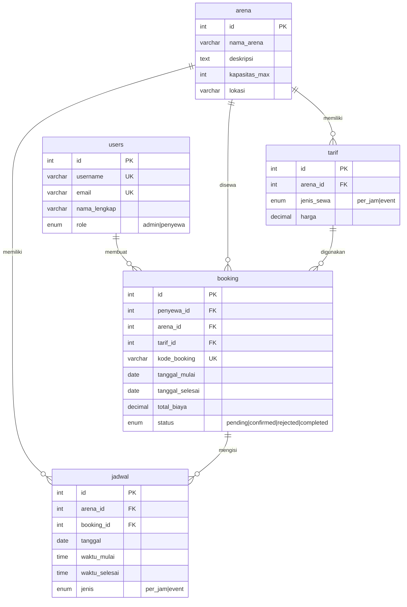

<p align="center">
  
  
  
  
</p>

# 🏟️ Velodrome Diponegoro — Sistem Informasi Penyewaan Arena

> Sistem informasi berbasis web untuk manajemen penyewaan arena olahraga di **Velodrome Diponegoro, Semarang**. Dibangun dengan PHP native (PDO), MySQL, dan UI modern menggunakan Tailwind CSS.

---

## 📸 Preview

| Halaman Utama | Dashboard Penyewa | Panel Admin |
|:---:|:---:|:---:|
| Landing page dengan hero 3D interaktif | Dashboard booking & riwayat | Manajemen arena, tarif & laporan |

---

## ✨ Fitur Utama

### 🏠 Public (Pengunjung)
- **Landing Page** — Hero section dengan animasi 3D Spline, statistik arena, dan CTA booking
- **Daftar Arena** — Menampilkan arena beserta harga, kapasitas, dan lokasi
- **Jadwal Ketersediaan** — Cek ketersediaan arena secara real-time
- **Artikel & Berita** — Informasi terbaru seputar Velodrome Diponegoro
- **Halaman Kontak** — Formulir kontak dan informasi lokasi

### 👤 Penyewa (User)
- **Registrasi & Login** — Autentikasi aman dengan password hashing (`bcrypt`)
- **Booking Arena** — Pilih arena, jenis sewa (per jam / event 3 hari), dan jadwal
- **Upload Bukti Bayar** — Unggah bukti transfer untuk verifikasi admin
- **Dashboard Penyewa** — Pantau status booking secara real-time
- **Riwayat Booking** — Lihat histori seluruh transaksi penyewaan
- **Cetak Invoice** — Generate invoice booking dalam format cetak

### 🛡️ Admin
- **Dashboard** — Overview statistik booking dan pendapatan
- **Manajemen Arena** — Tambah, edit, hapus arena dan foto cover
- **Manajemen Tarif** — Kelola harga sewa per jam dan event untuk setiap arena
- **Verifikasi Booking** — Konfirmasi/tolak booking berdasarkan bukti pembayaran
- **Manajemen Artikel** — CRUD artikel dengan slug otomatis dan thumbnail
- **Laporan** — Rekap data booking dan pendapatan

---

## 🗂️ Struktur Proyek

```
velodrome-diponegoro/
├── admin/                    # Panel admin
│   ├── index.php             # Dashboard admin
│   ├── arena.php             # CRUD arena
│   ├── tarif.php             # CRUD tarif/harga
│   ├── booking.php           # Verifikasi booking
│   ├── artikel.php           # CRUD artikel
│   └── laporan.php           # Laporan & rekap
│
├── auth/                     # Autentikasi
│   ├── login.php             # Halaman login
│   ├── register.php          # Halaman registrasi
│   └── logout.php            # Proses logout
│
├── penyewa/                  # Area penyewa
│   ├── index.php             # Dashboard penyewa
│   ├── booking.php           # Form booking arena
│   ├── riwayat.php           # Riwayat booking
│   └── cetak-invoice.php     # Cetak invoice PDF
│
├── config/
│   └── koneksi.php           # Koneksi DB & helper functions
│
├── includes/                 # Template partials
│   ├── header.php            # Header & navbar publik
│   ├── footer.php            # Footer publik
│   ├── admin_header.php      # Header panel admin
│   └── admin_footer.php      # Footer panel admin
│
├── assets/
│   ├── css/style.css         # Stylesheet utama
│   ├── js/main.js            # JavaScript (scroll reveal, navbar)
│   └── uploads/              # Upload gambar (cover, thumbnail, bukti bayar)
│
├── index.php                 # Landing page
├── jadwal.php                # Jadwal ketersediaan arena
├── artikel.php               # Halaman daftar & detail artikel
├── kontak.php                # Halaman kontak
└── database.sql              # Schema & seed data SQL
```

---

## 🛠️ Tech Stack

| Layer | Teknologi |
|-------|-----------|
| **Backend** | PHP 8.x (Native, PDO) |
| **Database** | MySQL 8.0 / MariaDB 10.x |
| **Frontend** | HTML5, Tailwind CSS (CDN), Vanilla JS |
| **Font** | [Inter](https://fonts.google.com/specimen/Inter) (Google Fonts) |
| **Icons** | [Font Awesome 6.5](https://fontawesome.com/) |
| **3D Visual** | [Spline](https://spline.design/) (Hero section) |
| **Server** | Apache (XAMPP / Laragon / VPS) |

---

## ⚡ Instalasi & Setup

### Prasyarat
- **PHP** ≥ 8.0
- **MySQL** ≥ 5.7 atau **MariaDB** ≥ 10.3
- **Apache** dengan `mod_rewrite` aktif
- **XAMPP** / **Laragon** / **WAMP** (untuk local development)

### Langkah Instalasi

```bash
# 1. Clone repository
git clone https://github.com/username/velodrome-diponegoro.git

# 2. Pindahkan ke direktori web server
# XAMPP:
cp -r velodrome-diponegoro /xampp/htdocs/velodrome

# 3. Import database
mysql -u root -p < database.sql
```

#### Atau import manual via phpMyAdmin:
1. Buka `http://localhost/phpmyadmin`
2. Buat database baru: `velodrome_db`
3. Import file `database.sql`

### Konfigurasi

Edit file `config/koneksi.php` sesuai environment:

```php
define('DB_HOST', 'localhost');
define('DB_NAME', 'velodrome_db');
define('DB_USER', 'root');
define('DB_PASS', '');           // Sesuaikan password MySQL
define('BASE_URL', '/velodrome');   // Sesuaikan path project
```

### Jalankan

```
http://localhost/velodrome/
```

---

## 👥 Akun Default

| Role | Username | Password |
|------|----------|----------|
| Admin | `admin` | `admin123` |

> ⚠️ **Penting:** Segera ubah password admin setelah instalasi pertama!

---

## 🗄️ Database Schema



---

## 🔒 Keamanan

- ✅ **Prepared Statements (PDO)** — Mencegah SQL Injection
- ✅ **Password Hashing** — Bcrypt via `password_hash()`
- ✅ **XSS Protection** — Output sanitization dengan `htmlspecialchars()`
- ✅ **Session-based Auth** — Role-based access control (Admin/Penyewa)
- ✅ **File Upload Validation** — Whitelist ekstensi & batas ukuran 2MB
- ✅ **CSRF-safe** — Session-based form handling

---

## 🎨 Design System

Proyek ini menggunakan design system modern dengan palet warna kustom:

| Token | Warna | Kegunaan |
|-------|-------|----------|
| `maroon-50` → `maroon-950` | 🟥 Merah Marun | Aksen utama, CTA, branding |
| `surface-50` → `surface-950` | ⬛ Slate/Dark | Background, teks, kartu |

**Fitur UI:**
- 🌙 Dark hero section dengan 3D interaktif
- 💫 Scroll-reveal animations (Vanilla JS)
- 🧊 Glassmorphism pada navigasi dan badges
- 📱 Fully responsive (mobile-first approach)
- 🎯 Floating capsule-style navbar

---

## 📄 License

Proyek ini dilisensikan di bawah [MIT License](LICENSE).

---

## 🤝 Kontribusi

Kontribusi sangat diterima! Silakan:

1. **Fork** repository ini
2. Buat **branch** fitur baru (`git checkout -b fitur/fitur-baru`)
3. **Commit** perubahan (`git commit -m 'Tambah fitur baru'`)
4. **Push** ke branch (`git push origin fitur/fitur-baru`)
5. Buat **Pull Request**

---

<p align="center">
  Dibuat dengan ❤️ untuk <strong>Velodrome Diponegoro, Semarang</strong>
</p>
